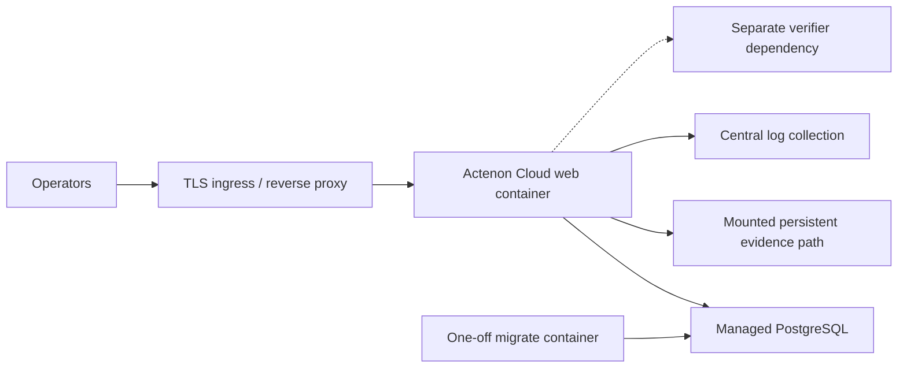

# Containerization Plan

## Goal

Define one repeatable containerized deployment form for a managed single-tenant Actenon Cloud invoice payment pilot.

This plan is intentionally narrow:

- one application image
- one migration invocation from that image
- one web invocation from that image
- one managed PostgreSQL dependency in hosted pilot form
- one mounted persistent evidence path

This is not a Kubernetes plan and not a platform installer.

## Container Boundary

The repo should continue to use one application image for all in-scope runtime duties.

That image should contain:

- Python 3.12
- the FastAPI application
- the built-in pilot UI assets
- Alembic
- schema files
- runtime scripts

It should be used in two explicit ways:

1. `migrate`
2. `web`

Do not add a worker image, queue image, or scheduler image in this phase. The repo does not require them.

## Current Container Artifacts

- [Dockerfile](/Users/sarahpounder/AI%20Agent%20Execution%20Control%20Layer/Dockerfile)
- [docker-compose.yml](/Users/sarahpounder/AI%20Agent%20Execution%20Control%20Layer/docker-compose.yml)
- [.env.compose.example](/Users/sarahpounder/AI%20Agent%20Execution%20Control%20Layer/.env.compose.example)
- [scripts/container-entrypoint.sh](/Users/sarahpounder/AI%20Agent%20Execution%20Control%20Layer/scripts/container-entrypoint.sh)

## Recommended Hosted-Pilot Shape



### Hosted Pilot

Keep:

- one `web` container
- one `migrate` job
- one mounted evidence path

Replace:

- local compose `db` with managed PostgreSQL

Keep outside the image:

- TLS termination
- secret injection
- log shipping
- backups
- verifier operations

## Commands

The container entrypoint already supports:

### Migration

```bash
./scripts/container-entrypoint.sh migrate
```

Equivalent command:

```bash
python -m alembic upgrade head
```

### Web

```bash
./scripts/container-entrypoint.sh web
```

Equivalent command:

```bash
python -m uvicorn app.main:app --host 0.0.0.0 --port 8000
```

### Combined Mode

```bash
./scripts/container-entrypoint.sh migrate-and-web
```

This exists, but it should not be the default hosted-pilot deployment shape. Separate migration and serving steps keep failure diagnosis clearer.

## Minimum Mounted Paths

### Required

- evidence root, for example `/var/lib/actenon-cloud/evidence`

### Not Required By Boot

- object storage mount or adapter
- shared cache volume
- worker scratch volume

## Minimum Environment Categories

### Required Application Runtime

- environment and network settings
- database URL
- evidence storage root
- auth mode and bootstrap secret
- proof issuer metadata
- signing secret
- capability release mode and TTL settings

### Hosted-Pilot Operator Metadata

Useful for deployment tooling or runbooks, but not currently consumed by the app:

- public hostname
- TLS cert and key paths
- object-storage backup target
- log collection target
- backup policy label
- reverse-proxy mode

## Startup Order

1. Provision PostgreSQL.
2. Provision the writable evidence path.
3. Inject env vars and secrets.
4. Build or pull the app image.
5. Run the image in `migrate` mode.
6. Start the image in `web` mode.
7. Confirm liveness.
8. Confirm readiness.
9. Only after that, perform operator bootstrap or validate pre-issued pilot tokens.

## Key Runtime Truths The Container Plan Must Respect

### One Process Serves Both API And Pilot UI

There is no separate frontend container requirement for the current pilot product surface.

### No Worker Tier Exists

Do not containerize queues or workers that the repo does not use.

### Evidence Is Filesystem-Backed

The app container needs a writable persistent path. It does not currently need a native object-storage adapter to boot.

### Hosted Pilot Is Still `staging-like`, Not `production`

The current settings model intentionally rejects production mode while pilot auth, pilot signing, and simulated release remain in place.

## Biggest Containerization Gaps

### Auth Bootstrap Gap

The repo has a usable app image, but not yet one clean staging-safe operator bootstrap path for a fresh hosted environment. That is a deployment workflow gap, not an image-build gap.

### No Published Artifact Flow Yet

The image can be built locally, but the repo does not yet define one canonical image publish and version promotion process for hosted pilot rollout.

### No Backup Automation In The Container Plan

Database backup and evidence backup remain external operational duties.

## What Not To Add In This Phase

- Kubernetes manifests
- Helm charts
- Redis
- Celery or RQ
- cron containers
- sidecar meshes
- multi-tenant control-plane packaging

Those would widen the deployment surface beyond the current pilot runtime.

## Recommended Next Implementation Steps

1. Lock one canonical hosted-pilot invocation pattern around `migrate` plus `web`.
2. Close the hosted auth bootstrap gap.
3. Add one image publish path.
4. Add one operator-owned backup and restore procedure for PostgreSQL plus evidence files.
