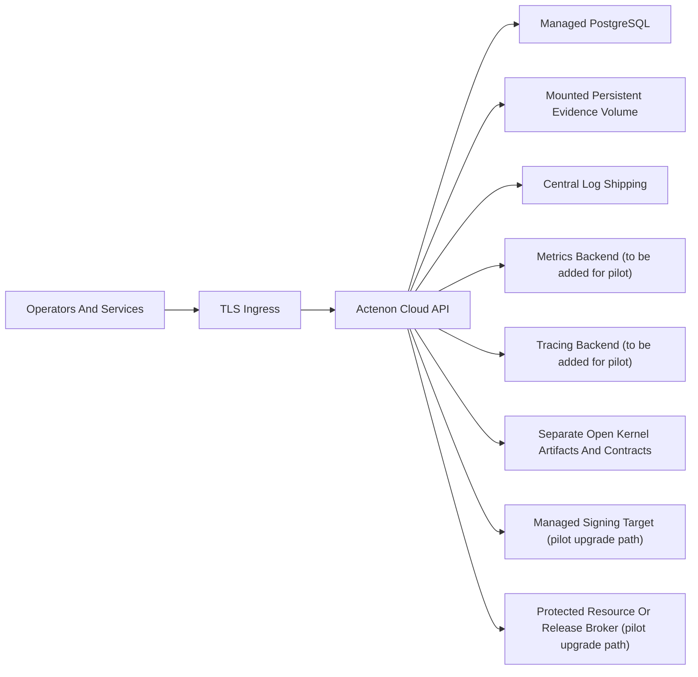

# Deployment Topology

## Purpose

This document describes the recommended topology for a controlled design-partner pilot. It is not a claim that production deployment automation already exists.

## What Exists Today

- one API service process
- one relational database connection layer
- one filesystem-backed evidence storage root
- one control-plane runtime that also performs issuance and escrow lifecycle handling
- no worker or background job tier

## Pilot Topology

## Design-Partner Pilot Requirements

- TLS ingress in front of the API
- managed database instead of SQLite
- mounted persistent storage instead of ephemeral container disk for evidence
- isolated environment with non-default secrets
- controlled tenant set and operator access
- central log shipping and basic health monitoring

## What Is Still Simulated Today

- managed signing target is not integrated
- protected resource release is not integrated
- metrics and tracing backends are not integrated
- managed object storage is not integrated; the current runtime uses a mounted filesystem path

## What Must Change For Production

- add deployment automation
- add HA or multi-zone topology where needed
- add managed signing integration
- add real release integration
- replace or harden the current filesystem evidence path with a production-grade storage integration
- add backup, restore, and failover procedures
