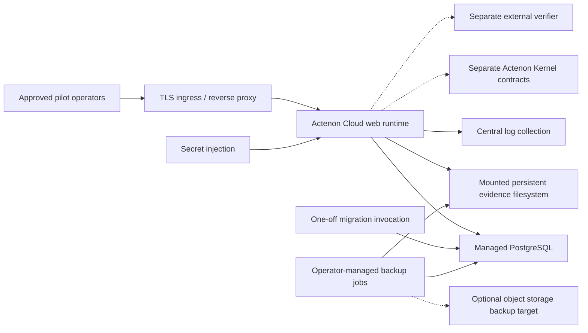

# Hosted Pilot Topology

## Purpose

This document defines the minimum concrete hosted topology for one managed single-tenant Actenon Cloud invoice payment pilot.

It is intentionally narrow:

- one deployment boundary per design partner
- one app runtime
- one managed PostgreSQL database
- one mounted evidence filesystem path
- one TLS ingress layer
- one central log path

This is not a multi-tenant SaaS topology and not a production-scale cloud architecture.

## Minimum Hosted Shape

## Required Hosted Components

### 1. App Runtime

- one deployed Actenon Cloud web runtime
- serves both API and built-in pilot UI
- no worker tier
- no queue broker

### 2. Migration Step

- one explicit migration invocation from the same app image
- run before the web runtime is allowed to serve traffic
- not automatic inside app startup

### 3. Database

- one managed PostgreSQL instance, or one dedicated database in a managed PostgreSQL service
- dedicated to the single design-partner environment
- not shared with unrelated customers

### 4. Evidence Storage

- one mounted persistent writable filesystem path
- attached to the web runtime
- included because uploaded evidence is filesystem-backed in the current implementation

### 5. TLS And Ingress

- one pilot-specific hostname
- one TLS ingress or reverse proxy
- TLS termination outside the app process

### 6. Central Logging

- one central destination for structured application logs
- pilot-scoped access to those logs for the operator team

### 7. Secret Injection

- one hosting-layer secret injection path
- non-default values for:
  - database credentials
  - bootstrap token
  - signing secret

## Optional Adjacent Component

### Object Storage

Object storage is not a required boot dependency for the current runtime.

If present in the hosted pilot, treat it as:

- a backup target
- an export target
- a future hardening aid

Do not describe it as the current live evidence write path.

## Deployment Boundary

One hosted pilot deployment boundary includes:

- the app runtime
- the migration step
- the pilot database
- the mounted evidence path
- ingress and TLS
- central logs
- injected secrets
- backup procedures for DB and evidence

It does not include:

- the open-source kernel repo
- the verifier implementation
- a shared multi-customer control plane
- self-serve provisioning

## Manual Versus Automated Reality

### Manual Or Operator-Driven Today

- environment creation
- secret provisioning
- TLS certificate placement or ingress configuration
- migration execution sequencing
- first-operator bootstrap strategy
- backup policy selection
- restore execution
- rollback decision-making

### Automated Or Platform-Assisted Today

- container restarts through the hosting layer
- managed PostgreSQL service health and provider backups, if enabled
- ingress forwarding
- central log shipping, if the hosting platform provides it
- app readiness probing through `/api/v1/health/ready`

## Why This Is The Minimum Honest Topology

This topology matches current code truth:

- the app is single-process
- readiness depends on the database and evidence filesystem
- evidence uploads are filesystem-backed
- central logs matter more than metrics or tracing today
- hosted pilot operation is supervised, not self-serve

## What This Topology Does Not Claim

- self-serve cloud onboarding
- broad shared multi-tenancy
- autoscaling
- HA failover
- multi-region recovery
- production-hardened enterprise hosting

## Supporting Documents

- [SINGLE_TENANT_DEPLOYMENT_MODEL.md](/Users/sarahpounder/AI%20Agent%20Execution%20Control%20Layer/SINGLE_TENANT_DEPLOYMENT_MODEL.md)
- [INFRASTRUCTURE_ASSUMPTIONS.md](/Users/sarahpounder/AI%20Agent%20Execution%20Control%20Layer/INFRASTRUCTURE_ASSUMPTIONS.md)
- [HOSTED_PILOT_RUNTIME.md](/Users/sarahpounder/AI%20Agent%20Execution%20Control%20Layer/HOSTED_PILOT_RUNTIME.md)
- [DATABASE_AND_MIGRATIONS.md](/Users/sarahpounder/AI%20Agent%20Execution%20Control%20Layer/DATABASE_AND_MIGRATIONS.md)
- [OBJECT_STORAGE_CONFIGURATION.md](/Users/sarahpounder/AI%20Agent%20Execution%20Control%20Layer/OBJECT_STORAGE_CONFIGURATION.md)
- [LOGGING_COLLECTION.md](/Users/sarahpounder/AI%20Agent%20Execution%20Control%20Layer/LOGGING_COLLECTION.md)
- [BACKUP_RESTORE_ASSUMPTIONS.md](/Users/sarahpounder/AI%20Agent%20Execution%20Control%20Layer/BACKUP_RESTORE_ASSUMPTIONS.md)
