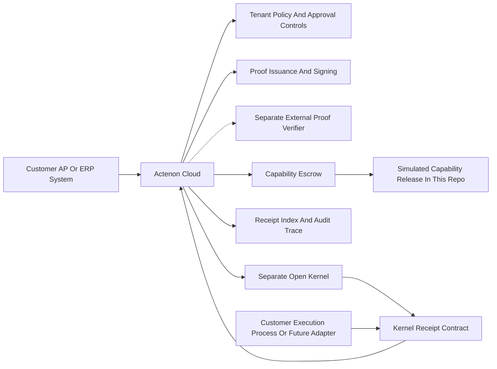

# Pilot Architecture

## Purpose

This document describes how the invoice payment execution pilot is deployed and where the open kernel, the separate external verifier repo or interface, and Actenon Cloud each fit.

## Architecture Summary

## What Runs From The Open Kernel

The separate open kernel remains responsible for:

- the canonical Action Intent and receipt contract families
- execution-side semantics
- any real execution adapters or provider-specific execution runtime

This pilot assumes the kernel context already exists outside this repo.

## What Runs From The Separate External Verifier Repo Or Interface

The separate verifier remains responsible for:

- proof verification logic
- proof validation semantics for issued proofs
- any verification outputs or interfaces consumed by operators or downstream systems

This repo may issue proofs and store proof records, but it does not embed or replace proof verification logic.

## What Runs From Actenon Cloud

This repo runs:

- Action Intent intake APIs
- tenant and policy management
- approval workflow
- evidence intake and storage references
- proof issuance and signing abstraction
- orchestration around external verifier interfaces and outputs
- capability escrow lifecycle
- receipt ingestion, reconciliation, and audit query APIs

## What Is Simulated Today

In the current repo, the following remains simulated:

- capability release to the protected resource
- provider or connector handoff enforcement
- full production observability stack

## What Needs Customer Integration

The customer or design partner must provide:

- an upstream invoice payment proposal source
- operator identities for requesters, approvers, and release managers
- tenant policy and approval rules
- invoice-reference mapping into Action Intent metadata and external references
- a receipt source from their payment process or kernel-connected execution path

If proof verification is required in the partner workflow, that verification must come from the separate verifier repo or verifier interface outside this repository.

Optional pilot-depth integration:

- a shallow adapter hook that consumes the simulated release token and emits provider execution references and receipts

## Recommended Pilot Environment

The pilot should run with:

- isolated non-local environment
- managed PostgreSQL
- mounted persistent evidence storage
- TLS ingress
- central log shipping
- non-default secrets

## Recommended Pilot Capability Scope

The pilot should use payment-specific scope labels such as:

- `finance.payment.release`
- `finance.payment.audit`

Protected resource references should stay narrow, for example:

- `provider://payments/invoice/outbound`
- `customer://erp/payments/manual-release`

## Receipt Flow

The design partner pilot stays commercially useful even if final execution is not yet automated by this repo.

The recommended receipt model is:

1. Actenon Cloud governs the payment before release.
2. The customer or a shallow adapter performs the actual payment step.
3. The resulting kernel-aligned receipt is posted back to Actenon Cloud.
4. Operators query the full payment trace from intake through receipt.
