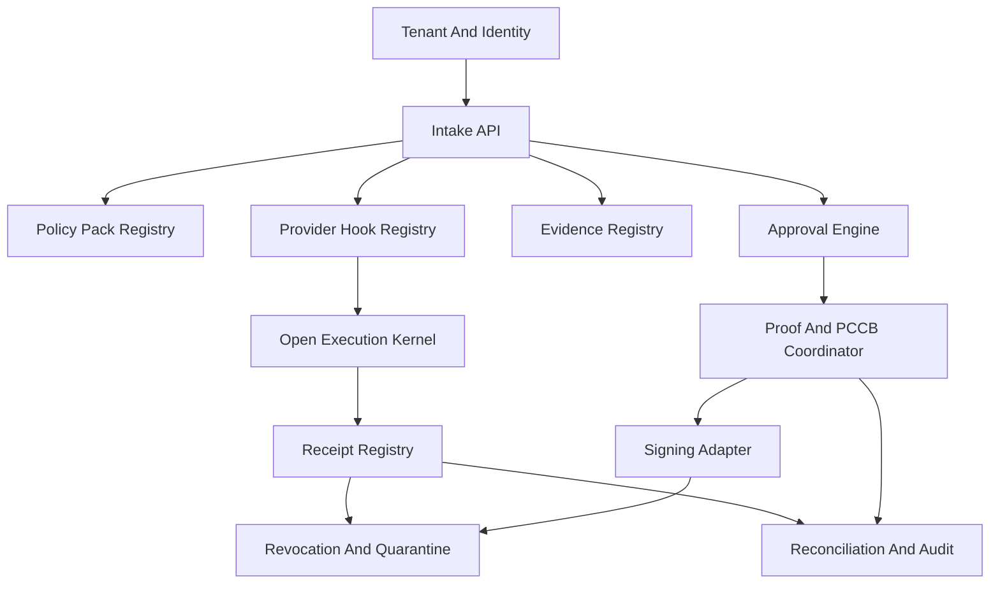

# Components

## Purpose

This document defines the logical components of Actenon Cloud and the boundary each component must maintain relative to the open execution kernel.

## Deployment Posture

The initial implementation should be a modular backend service or modular monolith, not a fleet of microservices. The components below are architectural modules and responsibility boundaries first.

## Component Boundaries

| Component | Responsibility | Owns Data | Kernel Relationship | Release 1 |
| --- | --- | --- | --- | --- |
| Tenant And Identity | Tenants, users, memberships, roles, service principals | Tenant, User, Role, Membership | No kernel dependency except auth context passed to intake | In scope |
| Intake API | Accepts submission envelopes and validates tenant context plus kernel contract compatibility | ActionIntentRecord | Validates referenced kernel Action Intent contract without redefining it | In scope |
| Policy Pack Registry | Stores versioned finance control rules | PolicyPack, WorkflowRule | None | In scope |
| Approval Engine | Creates approval requests, records decisions, enforces segregation of duties | ApprovalRequest, ApprovalDecision | None | In scope |
| Evidence Registry | Registers and links evidence objects with integrity metadata | EvidenceObject | None | In scope |
| Receipt Registry | Ingests and indexes kernel-aligned receipts | ReceiptRecord, ReplayConsumptionState | Consumes canonical kernel receipts | Narrow implementation in scope |
| Reconciliation And Audit | Compares expected and observed artifacts and emits durable audit events | ReconciliationRecord, AuditEvent | Reads kernel-linked artifacts but does not reinterpret them | Narrow implementation in scope |
| Proof And PCCB Coordinator | Packages proofs or PCCBs around approved intents and observed receipts | IssuedProof | Uses kernel outputs as inputs, never replaces proof semantics | Narrow implementation in scope |
| Signing Adapter | Resolves signing key references and requests sign operations from managed key providers | SigningKeyReference | May sign control-plane bundles, not kernel verifier semantics | Narrow implementation in scope |
| Capability Escrow | Holds or releases scoped capabilities subject to approval or proof conditions | EscrowRecord | None | Narrow implementation in scope |
| Provider Hook Registry | Records outbound provider hook requests and callbacks | ProviderExecutionHook | Observes orchestration around execution, not execution authority | Modeled only |
| Revocation And Quarantine | Applies quarantine, release, or revocation posture to governed artifacts | ArtifactControlState | May respond to kernel invalidation signals | In scope for minimal control state |
| Kernel Contract Compatibility Layer | Tracks pinned kernel contract references and compatibility checks | Contract reference metadata | Direct dependency on kernel-published artifacts | In scope |

## Interaction Overview

## Component Notes

### Intake API

The intake layer owns the control-plane submission contract. It should accept:

- tenant and requester context
- idempotency key
- optional policy binding hints
- a canonical kernel Action Intent payload or reference

It must not restate kernel-defined intent fields in a competing local schema.

### Approval Engine

The approval engine is the control-plane center of gravity for Release 1. It should evaluate finance policies, create approval work items, and record decisions with durable actor and evidence links.

### Receipt Registry

This component ingests immutable kernel receipts and creates query indexes. It should preserve the canonical payload and maintain derived indexes separately.

### Proof And PCCB Coordinator

This module exists in the domain model now because the repository must own proof issuance workflows. Release 1 should keep the feature narrow by focusing on orchestration records and proof references rather than broad issuance capabilities.

### Provider Hook Registry

This is a hook and correlation module only. If a provider or adapter reports statuses or callbacks, the control plane stores the facts it observed without claiming authoritative execution semantics.

## Release 1 Component Slice

The narrow Release 1 component slice should prioritize:

- Tenant And Identity
- Intake API
- Policy Pack Registry
- Approval Engine
- Evidence Registry
- Proof And PCCB Coordinator
- Signing Adapter
- Capability Escrow
- minimal Revocation And Quarantine posture
- Receipt Registry
- Reconciliation And Audit

The remaining components should be designed now but left intentionally thin until their contracts and operational constraints are validated.
