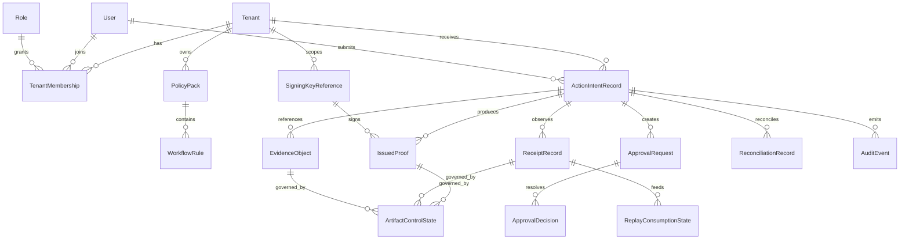

# Domain Model

## Purpose

This document defines the core domain entities and boundaries for Actenon Cloud. It is intentionally limited to the control-plane layer and does not redefine execution-kernel semantics.

## Kernel Alignment Rules

- The public `Action Intent` contract remains owned by the separate open execution kernel.
- The control plane may wrap a kernel-owned Action Intent in a control-plane intake envelope, but it should not fork or reinterpret canonical intent semantics.
- Kernel receipts, proof primitives, and execution outcomes remain kernel-owned artifacts. The control plane stores, indexes, governs, and packages them.
- Control-plane state should describe governance and observation, not replace kernel execution truth.

## Release 1 Domain Focus

Release 1 is centered on finance actions. The initial domain profile should support policy and approval workflows around:

- payment initiation
- transfer authorization
- payout or disbursement requests
- collection instructions
- settlement instructions

These finance-oriented classes are control-plane routing and policy categories. They do not replace the canonical kernel Action Intent schema.

## Bounded Contexts

### Tenant And Identity

Owns tenants, users, memberships, roles, service principals, and tenant-scoped administration.

### Intake

Owns submission envelopes, idempotency keys, intake validation outcomes, intake metadata, and the immutable storage reference to the kernel Action Intent payload.

### Policy And Approval

Owns policy packs, workflow rules, approval requests, approval decisions, and escalation or timeout handling.

### Evidence

Owns evidence registration, integrity metadata, object references, retention posture, and evidence-to-workflow linkage.

### Proof, Signing, And Escrow

Owns proof or PCCB orchestration, signing key references, signing operation records, and escrow bookkeeping. Release 1 should model these areas without claiming full maturity.

### Receipt And Reconciliation

Owns receipt ingestion, indexing, replay or consumption state, reconciliation records, and audit records built around kernel artifacts.

### Revocation And Quarantine

Owns artifact control state for quarantine, release, and revocation posture.

## Core Entities

| Entity | Owned By | Purpose | Release 1 |
| --- | --- | --- | --- |
| `Tenant` | Control plane | Primary commercial and isolation boundary | In scope |
| `User` | Control plane | Human identity used for admin, review, and approvals | In scope |
| `Role` | Control plane | Named permission bundle or approval entitlement | In scope |
| `TenantMembership` | Control plane | Binds users to tenants and role assignments | In scope |
| `PolicyPack` | Control plane | Versioned set of finance workflow and control rules | In scope |
| `WorkflowRule` | Control plane | Individual rule within a policy pack | In scope |
| `ActionIntentRecord` | Control plane | Immutable intake record bound to a canonical kernel Action Intent payload | In scope |
| `EvidenceObject` | Control plane | Registered evidence item, filesystem-backed upload, or external storage pointer | In scope |
| `ApprovalRequest` | Control plane | Unit of approval work generated by policy | In scope |
| `ApprovalDecision` | Control plane | Durable approval or rejection decision | In scope |
| `IssuedProof` | Control plane above kernel outputs | Reference to issued proof or PCCB bundle | Narrow implementation in place |
| `SigningKeyReference` | Control plane | Metadata and provider reference for managed signing keys | Narrow implementation in place |
| `EscrowRecord` | Control plane | Holds capability release state and policy bindings | Narrow implementation in place |
| `ReceiptRecord` | Control plane with kernel artifact | Immutable ingested kernel receipt plus indexing metadata | Narrow implementation in place |
| `ReplayConsumptionState` | Control plane | Tracks central replay or consumer progress when receipts drive internal workflows | In scope if centrally managed |
| `ProviderExecutionHook` | Control plane | Stores outbound hook requests and inbound provider callbacks or correlations | Modeled, narrow implementation later |
| `ReconciliationRecord` | Control plane | Tracks expected-versus-observed finance workflow reconciliation | Narrow implementation in place |
| `AuditEvent` | Control plane | Immutable audit trail of state transitions and actions | Narrow implementation in place |
| `ArtifactControlState` | Control plane | Quarantine, release, and revocation posture for governed artifacts | In scope |

## Key Entity Relationships

## Entity Notes

### Tenant

The tenant is the top-level governance boundary. Every Action Intent, approval request, receipt index, proof, and audit event belongs to exactly one tenant in Release 1.

### User And Approver

An approver is not a separate identity type. It is a user or service principal that has the required role, membership, and policy eligibility for an approval request.

### PolicyPack And WorkflowRule

`PolicyPack` is versioned and tenant-scoped. `WorkflowRule` entries define approval counts, evidence requirements, finance thresholds, segregation-of-duties constraints, escalation timers, and proof or signing prerequisites.

### ActionIntentRecord

This is the control-plane anchor entity. It stores:

- the control-plane submission envelope
- the immutable reference to the canonical kernel Action Intent payload
- idempotency and tenancy metadata
- derived finance indexes used for routing, policy evaluation, and search
- separate state axes for intake, approval, proof, execution observation, and receipt ingestion

### EvidenceObject

Evidence may be uploaded content, an external reference, or a structured attestation. The control plane stores custody and integrity metadata even when the bytes live in object storage.

### ApprovalRequest And ApprovalDecision

An Action Intent may yield many approval requests. A decision is immutable once recorded; later changes happen by creating superseding decisions or new approval requests, not by rewriting the original decision.

### IssuedProof

`IssuedProof` represents a control-plane-issued bundle such as a PCCB or signed attestation. It may reference kernel proofs or receipts but must not redefine their semantics.

### ProviderExecutionHook

This entity records orchestration handoffs, callback correlations, or provider acknowledgments. It is not the authoritative execution record. Kernel outcomes and receipts remain the execution truth.

### ArtifactControlState

This entity centralizes quarantine, release, and revocation posture for proofs, evidence, receipts, and escrow items. It lets the control plane govern suspect or invalid artifacts without mutating the underlying payload.

## Explicit Boundary On Execution State

The control plane may track coarse execution observation states such as "dispatch requested" or "result observed." It must not create a competing execution lifecycle that conflicts with the kernel’s execution model.
